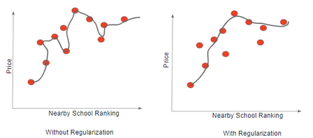

# Machine Learning basics

## Bias - Variance Trade-off
Bias means being more **generic** and Variance being more **specific** .

For example, suppose I want to rent an apartment in the Bay Area, and for that I would like to check 100 apartments and take their average.

If  I take 100 apartments all over California, the model would be more generic and will give a **high bias**, which means that it won't predict well apartments in Bay Area. I'll get **underfitting**

On the other hand, if I'll take 100 apartment in Bay Area, the model would be very specific and we'll get **high variance**, and **overfitting**

## Regularization (L1, L2, Dropouts)
Regularization is a way to control Bias and Variance (and thus preventing overfitting), it especially reduces the complexity of the model either by getting rid of the complex features or reducing their importance.

For example, if the price of a house if based on 4 features: 
* location ($$X_1$$)
* number of bedrooms ($$$X_2$)
* year on construction ($$$X_3$)
* nearby school rating ($$$X_4$)
when predicting the price of a house we may get similar equation:
$$Y = 2.5 * X_1+3*X_1X_2+1.4X_3^2+4.5X_4^3+1.6$$
Regularization will reduce the importance of features, especially the ones with higher polynomial degree ($$X_3$$ and $$X_4$$).
Mathematically, reducing the importance if hight degree polynomials is nothing but reducing the weights of the hight degree polynomials ($$1.4$$ ane $$4.5$$ in the function above).

Reducing the importance of higher degree polynomials result in making the relationship curve between a feature and the predicted variable smoother, thereby increasing the generalization.

### L1 Regularization - Lasso Regression
LASSO - Least Absolute Shrinkage and Selection Operator
This regularization adds "absolute value of magnitude" coefficient as penalty to the loss function.
$$$
\sum_{i=1}^n(Y_i-\sum_{j-1}^pX_{ij}\beta_j)^2+\lambda\sum_{j=1}^p|\beta_j|
$$$
If $$\lambda$$ is 0 then we will get back ordinary least squares mean, whereas very large value will make coefficients zero, hence it will underfit.